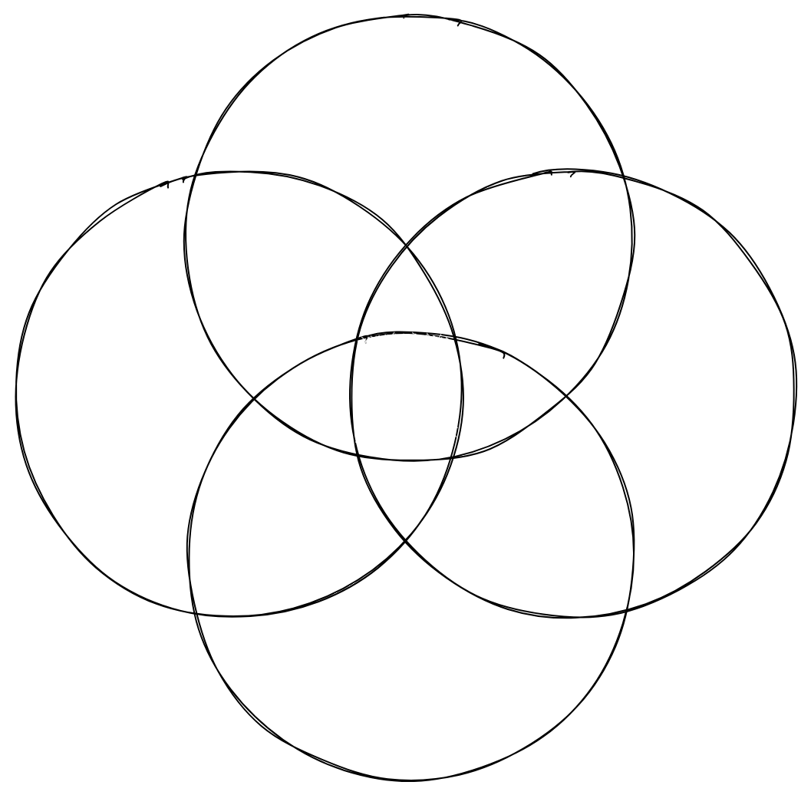

# [fit] Micro-frontends,
### [fit] **three years after**

 
 
 

### @**_maxgallo**

---

## __In 2019 I was on this stage with__ Luca Mezzalira __to introduce DAZN approach to__ Micro-frontends.

^ March 2019
^ Incredible response / feedback / questions

                   
https://bit.ly/talk-max-luca

---

# [fit] Hi 👋 I'm Max

### 🇮🇹 🇬🇧 🍝 💻 🎶 🏍 📷 ✈️ ✍️

### **Principal Engineer @ DAZN**

          

### twitter: @**_maxgallo**
### web: **maxgallo.io**

---

<!--

Intro
    - DAZN Context
        - Product
        - Number of teams
    - Three Years ago
        - 6 Vertical MFE (catalog, auth, landingpage, help, myaccount, error)
        - Bootstrap: clientside orchestrator
        - Not a single line of code shared
        - Autonomous teams

Challenges
  - Vertical MFE where too big
    - How to spot the signs
        - release trains
        - cross teams coordination needed
    - What we put in place
        - systemJS wrapper
        - Comparison: Module Federation or Single-SPA ?
  - Extreme of autonomy -> Silo
    - How to spot the signs
        - Principal Engineers or cross team tech people
    - What to put in place
        - FE Guilds
        - RFC
        - Service Discovery: Backstage
  - Sharing: is it a problem?
    - Visual Inconsistencies
    - What are we sharing
        - payments
        - experiments
        - payments
Takeaways
  - Re evaluate the decisions (And keep Decision Records)
  - Think about sharing but don't use "number of shared components" as metric
  - aaaaa

-->

# Agenda

## ☞ __Once Upon a Time__
## ☞ __Domain Boundaries Evolution__
## ☞ __Beyond Team Autonomy__
## ☞ __Sharing Code__

---

[.column]
# [fit] __Once Upon a Time__
### Part 1 of 4

[.column]
 

---

# __Once Upon a Time, there was a Live Sport Streaming Company, called__ DAZN

---

[.column]
# __DAZN Engineering department was growing__ exponentially

[.column]
 

---

# __We needed a better solution to sustain our growth and future plans, so we introduced__ Micro-frontends.

---

[.column]

## __To highlight the pillars of our solution, we created the__ Micro-frontends Manifesto.
                  
### @**_maxgallo**

[.column]
   
### ☞ __Independent implementation, avoid sharing logic__
### ☞ __Modelled around a Business Domain__
### ☞ __Owned by a single team__

<!--

# [fit] __2018__ Runtime Frontend Architecture

^ 6 Vertical MFE (catalog, auth, landingpage, help, myaccount, error)
^ Bootstrap: clientside orchestrator
^ Not a single line of code shared
^ Autonomous teams
-->

---
...and they lived happily ever after

---

...and they lived happily ever after
#[fit] __Nope!__

---

[.column]
# [fit] __Domain Boundaries Evolution__
### Part 2 of 4

[.column]
 

---

[.column]
# __Some vertical Micro-frontends were__ too big __for a single team.__

^ Release Trains
^ Cross-teams coordination needed

                     

### @**_maxgallo**

[.column]
 

---
# __Our business subdomains are not immutable, so we re-defined their__ boundaries.

^ We merged microfrontends
^ Runtime Approach doesn't change, there's always one team in every view
^ there are limits for this

---

# __A Subdomain did contain a complex subsystem[^1] that__ was not considered a Micro-frontend.

[^1]: From "Team Topologies"

^Ownership is at least a page.

---

# [fit] __Micro-frontends:__ Vertical & Horizontal[^2]

[^2]: Module Federation, Single SPA

---

[.column]
# __Deep Dive into__ Horizontal Micro-frontends

[.column]
 

## ☞ __Multiple Teams owning parts of the same page__
## ☞ __Coordination needed__
## ☞ __Independent Releases__

---

[.column]
# __Deep Dive into Horizontal Micro-frontends in__ DAZN
    
☞ SystemJS
☞ Relationship with host
☞ Deployment strategy

[.column]
 

^ Wrapper Around SystemJS
^ Breaking Changes releases (major in semver) are blocked by host
^ Other releases (Minor & patch) are owned by team

<!--
# [fit] __Solution #2__ Horizontal Micro-Frontends

^ systemJS wrapper
^ Comparison: Module Federation or Single-SPA ?
-->

---

[.column]
# [fit] __Beyond Team Autonomy__
### Part 3 of 4

[.column]
 

---
# __Teams were very autonomous, with the risk of creating__ silos.

^ How to spot the signs
^ Principal Engineers or cross team tech people

                    

### @**_maxgallo**

---

[.column]
# Share Knowledge
     
### __☞__ Frontend Guilds
### __☞__ Principals & Architects

[.column]
 

[.column]
 

---

[.column]
# Share Knowledge
     
### __☞__ Frontend Guilds
### __☞__ Principals & Architects

[.column]
# __Decide Together__
     
### __☞ Request For Comments (aka RFC)__

[.column]
 

---

[.column]
# Share Knowledge
     
### __☞__ Frontend Guilds
### __☞__ Principals & Architects

[.column]
# __Decide Together__
     
### __☞ Request For Comments (aka RFC)__

[.column]
# Discover  More
     
### __☞__ Backstage (Spotify)

---

[.column]
# [fit] __Sharing Code__
### Part 4 of 4

[.column]
 

---

# __We've got small__ visual inconsistencies __, but not a single visual component has been shared across all the Micro-frontends,__ yet.

^ it's been not easy how "not share" was helping deliver faster

        

### @**_maxgallo**

---

# __In DAZN, we're starting to share things because our priorities are changing.__ Share as solution, not as a goal.

^ New Phase soon (company is more mature)
^ something currently shared: payments (business critical)

         

### @**_maxgallo**

---

# [fit] Takeaways

__☞__ Your business subdomain ar note immutable
__☞__ Iterate and keep Decision Records
__☞__ Think about sharing, but accept duplication
__☞__ It's always about people

     

### @**_maxgallo**
---

 

#[fit] Thank You

# [fit] **github.com/maxgallo/talk-micro-frontends-three-years-after**
 

### @**_maxgallo**

