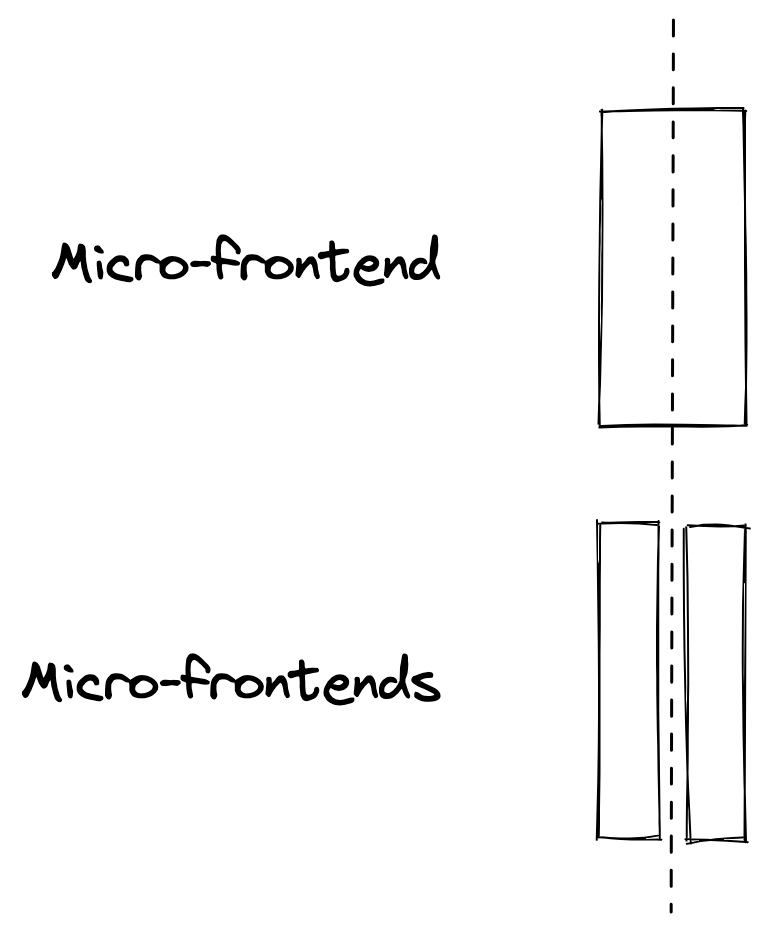

# [fit] Micro-frontends,
### [fit] **three years after**

 
 
 

### @**_maxgallo**

---

# [fit] Hi 👋 I'm Max

### 🇮🇹 🇬🇧 🍝 💻 🎶 🏍 📷 ✈️ ✍️

### **Principal Engineer @ DAZN**

          

### twitter: @**_maxgallo**
### web: **maxgallo.io**

---

<!--

Intro
    - DAZN Context
        - Product
        - Number of teams
    - Three Years ago
        - 6 Vertical MFE (catalog, auth, landingpage, help, myaccount, error)
        - Bootstrap: clientside orchestrator
        - Not a single line of code shared
        - Autonomous teams

Challenges
  - Vertical MFE where too big
    - How to spot the signs
        - release trains
        - cross teams coordination needed
    - What we put in place
        - systemJS wrapper
        - Comparison: Module Federation or Single-SPA ?
  - Extreme of autonomy -> Silo
    - How to spot the signs
        - Principal Engineers or cross team tech people
    - What to put in place
        - FE Guilds
        - RFC
        - Service Discovery: Backstage
  - Sharing: is it a problem?
    - Visual Inconsistencies
    - What are we sharing
        - payments
        - experiments
        - payments
Takeaways
  - Re evaluate the decisions (And keep Decision Records)
  - Think about sharing but don't use "number of shared components" as metric
  - aaaaa

-->

[.column]
      
# [fit] Agenda

[.column]
   
# 🂡 __Three Years Ago__
# 🂢 __Three Challenges__
# 🂣 __Three Takeaways__

---
# [fit] Three Years Ago 
# __Three Challenges__
# __Three Takeaways__
 
 
 
### @**_maxgallo**

---

[.column]

  
# [fit] DAZN
# [fit] Three Years Ago

[.column]
     
## ☞ __Live Sport Streaming__
## ☞ __Rapid Growth__
## ☞ __~6 Frontend teams__

---

# [fit] __2018__ Frontend Architecture

^ 6 Vertical MFE (catalog, auth, landingpage, help, myaccount, error)
^ Bootstrap: clientside orchestrator
^ Not a single line of code shared
^ Autonomous teams

---

# [fit] __Micro-frontends:__ Vertical vs Horizontal

^ 6 Vertical MFE (catalog, auth, landingpage, help, myaccount, error)
^ Bootstrap: clientside orchestrator
^ Not a single line of code shared
^ Autonomous teams

---

# [fit] __2018__ Runtime Frontend Architecture

^ 6 Vertical MFE (catalog, auth, landingpage, help, myaccount, error)
^ Bootstrap: clientside orchestrator
^ Not a single line of code shared
^ Autonomous teams

---

# __Three Years Ago__ 
# [fit] Three Challenges
# __Takeaways__
 
 
 
### @**_maxgallo**

---

__Challenge #1: Boundaries Definition__
    
# __Some vertical Micro-frontends were__ too big __for a single team.__

^ Release Trains
^ Cross-teams coordination needed

          

@**_maxgallo**

---

# __Solution #1__ Re-define boundaries

^ Runtime Approach doesn't change, there's always one team in every view

---

# __Vertical Micro-Frontend,__ Ownership is at least a page.

---

# [fit] __Solution #2__ Horizontal Micro-Frontends

^ systemJS wrapper
^ Comparison: Module Federation or Single-SPA ?

---

[.column]
     
# [fit] Deep Dive
## [fit] Horizontal Micro-frontends

[.column]
 

## ☞ __Multiple Teams owning parts of the same page__
## ☞ __Coordination needed__
## ☞ __Independent Releases__

^ Example: complex subsystem (Team topologies): playback

---

# Deep Dive
## __Horizontal Micro-frontends__
## __in__ DAZN

^ Wrapper Around SystemJS
^ Breaking Changes releases (major in semver) are blocked by host
^ Other releases (Minor & patch) are owned by team

---

__Challenge #2: Beyond Team Autonomy__
    
# __Teams were autonomous, but creating__ silos.

^ How to spot the signs
^ Principal Engineers or cross team tech people

          

@**_maxgallo**

---

[.column]

# Share Knowledge
     
### __☞__ Frontend Guilds

[.column]

# __Decide Together__
     
### __☞ Request For Comments (aka RFC)__

[.column]

# Discover  More
     
### ☞ Backstage (Spotify)

---

__Challenge #3: To Share, or not to Share__
 
# __There are__ visual inconsistencies __, but not a single visual component has been shared across all the Micro-frontends,__ yet.

^ it's been not easy how "not share" was helping deliver faster
^ New Phase soon (company is more mature)
^ something currently shared: payments (business critical)

  

@**_maxgallo**

---

# __Three Years Ago__ 
# __Three Challenges__
# [fit] Three Takeaways
 
 
 
### @**_maxgallo**
---

# [fit] Three Takeaways

  - Re evaluate your decisions, and keep Decision Records
  - Think about sharing but don't use "number of shared components" as metric
  - It's always about people

---

#[fit] Thank You

# [fit] **github.com/maxgallo/talk-micro-frontends-three-years-after**

 
 
 

### @**_maxgallo**
